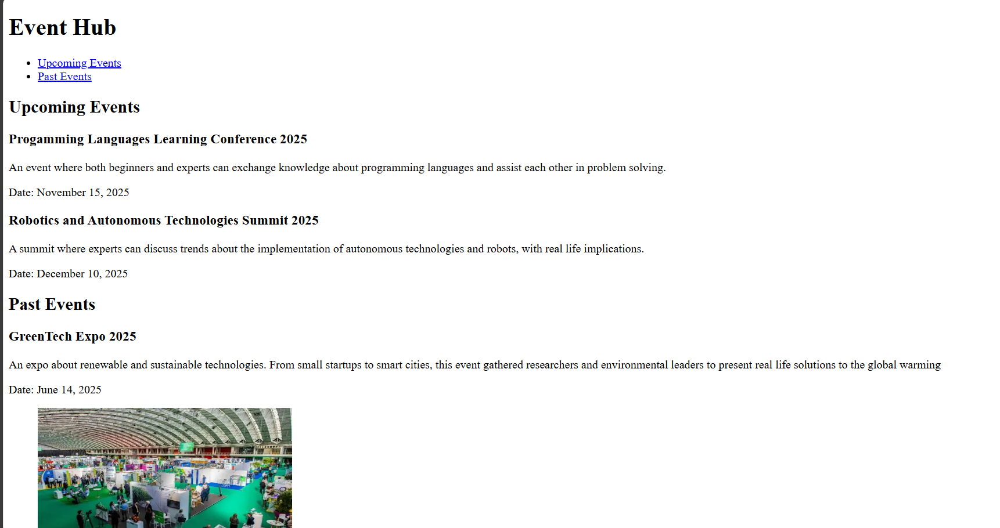

# Event-hub

An event hub page created with semantic while learning the basics of HTML.

## Demo

https://irdxe.github.io/event-hub/

## About

This project was built to practice semantic HTML and basic structure based on freeCodeCamp exercises

- Semantic HTML (header, main, nav, article, section, figure)
- Heading hierarchy (h1 --> h2 --> h3)
- Links, lists and images

## What I learned

- Proper use of semantic elements and headings
- Creating navigation links
- Organizing images and alt attributes

## How to run locally
1. Clone:
   git clone https://github.com/irdxe/event-hub.git
2. Open:
   Open `index.html` in your browser.

## Screenshot

## Credits

Based on freeCodeCamp exercises https://www.freecodecamp.org/

